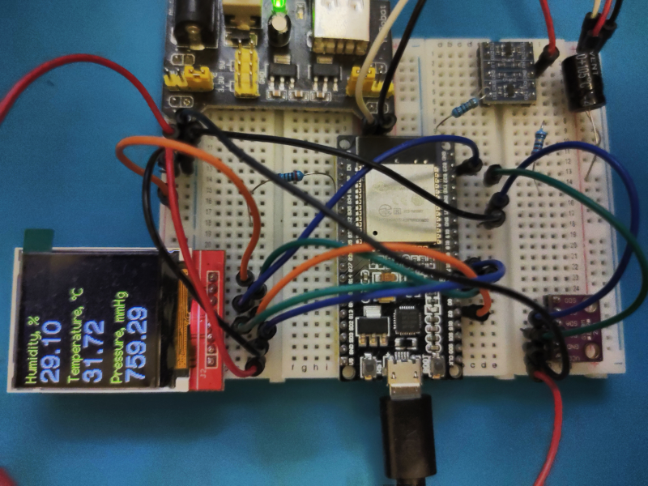

# ESP32_BME280_ST7735

A meteostation with the following features:
- Espressif ESP32 WROOM as a microcontroller;
- Bosch Sensortec BME280 as a sensor for:
  - Altitude;
  - Atmospheric pressure;
  - Humidity;
  - Temperature;
- Noname ST7735 128x128 color 1.8″ TFT display

