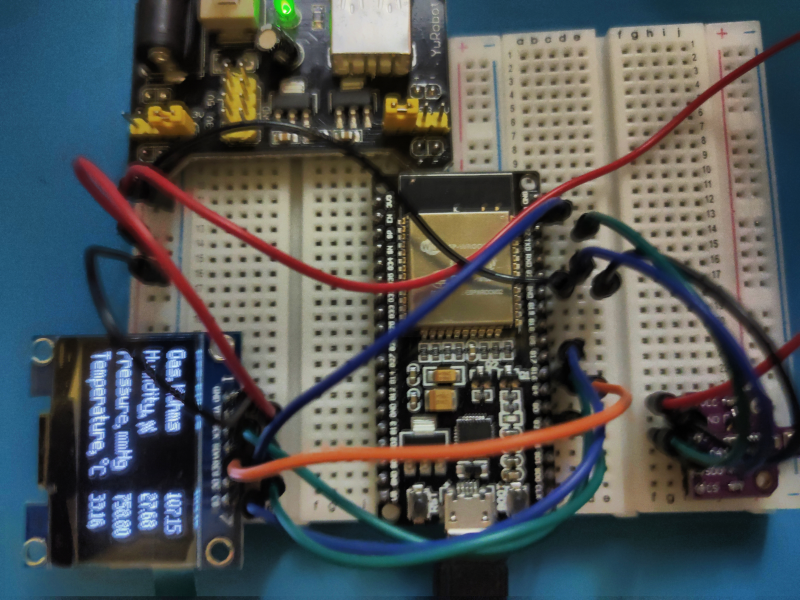

# ESP32_BME680_SH1106

A meteostation with the following features:
- Espressif ESP32 WROOM as a microcontroller;
- Bosch Sensortec BME680 as a sensor for:
  - Altitude;
  - Atmospheric pressure;
  - Gas sensor;
  - Humidity;
  - Temperature;
- Noname SH1106 128x64 color 1.3″ OLED display

